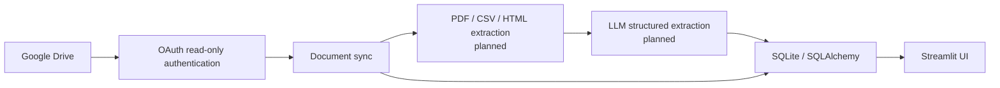

# Document Intelligence

Take-home project skeleton for a Streamlit application that connects to Google Drive, synchronizes supported financial-document metadata, and provides a foundation for document extraction and structured financial analysis.

> **Current implementation:** Google OAuth, folder selection, incremental PDF/CSV/HTML synchronization, PDF text extraction, typed local Ollama financial extraction, SQLite persistence, sync summaries, and document-status UI are implemented. Ask Your Documents uses the local model for grounded responses from extracted records.

## Features

- Connects to Google Drive with a local OAuth flow and read-only Drive scope.
- Reuses a locally saved `token.json` token and refreshes it when possible.
- Lists Drive folders and lets the user select a monitored folder.
- Synchronizes PDF, CSV, and HTML file metadata when the user clicks **Sync Google Drive**.
- Detects new, unchanged, and modified files by Google Drive file ID and `modifiedTime`.
- Stores file metadata and per-folder last successful sync time in SQLite through SQLAlchemy.
- Downloads and processes PDF files with PyMuPDF and local Ollama structured output.
- Stores normalized financial records linked to their source documents.
- Displays sync counts and a document-status table in Streamlit.
- Shows clear setup, connection, synchronization, and empty states.

CSV and HTML files are synchronized as metadata but are not yet processed for extraction. The application does not yet provide general-purpose natural-language Q&A.

## Architecture

The intended end-state architecture is shown below. The portions marked as planned are not part of the current implementation.



## Tech Stack

- Python 3.11+
- Streamlit for the user interface
- Google Drive API via `google-api-python-client`
- Google OAuth via `google-auth-oauthlib`
- SQLite and SQLAlchemy for synchronized metadata
- pandas for the current UI's tabular data boundary
- PyMuPDF for PDF text extraction; BeautifulSoup is reserved for future HTML parsing
- Ollama with llama3.2:3b for typed structured financial extraction and Q&A

## Project Structure

```text
.
├── app.py                              # Streamlit entry point
├── requirements.txt                    # Runtime dependencies
├── pyproject.toml                      # Package metadata and src layout
├── src/document_intelligence/
│   ├── database.py                     # SQLite engine and session setup
│   ├── google_drive.py                 # OAuth and folder listing
│   ├── models.py                       # DriveFile and SyncState models
│   ├── sync.py                         # Incremental metadata synchronization
│   ├── extraction.py                   # Reserved extraction module
│   ├── parsers.py                      # Reserved parser module
│   └── ingestion.py                    # Reserved ingestion module
└── data/                               # Local SQLite database, ignored by Git
```

## Setup

Clone the repository and enter its directory:

```powershell
git clone <repository-url>
cd document-intelligence
```

Create and activate a virtual environment:

```powershell
python -m venv .venv
.\.venv\Scripts\Activate.ps1
```

Install the dependencies and the local package:

```powershell
python -m pip install -r requirements.txt
python -m pip install -e .
```

Add the downloaded Google OAuth client file to the project root with exactly this name:

```text
credentials.json
```

The application creates `data/document_intelligence.db` automatically. On first connection, Google creates `token.json` after the browser consent flow.

## Google OAuth Setup

1. Open [Google Cloud Console](https://console.cloud.google.com/) and create or select a project.
2. Enable the **Google Drive API** for that project.
3. Configure the OAuth consent screen. For a take-home project, **External** and **Testing** are suitable defaults.
4. Add the Google account used for the demo as a test user.
5. Create OAuth credentials for a **Desktop app**.
6. Download the client JSON file and save it as `credentials.json` in the project root.

The app requests `https://www.googleapis.com/auth/drive.readonly`. The first connection opens a local browser consent flow. The resulting token is saved to `token.json` and reused on later runs. Never commit either JSON file.

## Environment Variables

The app uses local Ollama at `http://localhost:11434` with the `llama3.2:3b` model. Pull it before running the app:

```powershell
ollama pull llama3.2:3b
```

The current implementation reads the fixed root-level `credentials.json` path for Google Drive OAuth and does not require any external API key.

## Running the Application

From the project root with the virtual environment active, run:

```powershell
streamlit run app.py
```

Streamlit will print a local URL, usually `http://localhost:8501`.

## How Synchronization Works

Synchronization is manual and starts when the user clicks **Sync Google Drive**:

1. The app queries the selected folder for non-trashed PDF, CSV, and HTML files.
2. Each file is matched by its Google Drive file ID.
3. A file ID not in `drive_files` is recorded as **new**.
4. A known file whose Drive `modifiedTime` is unchanged is **skipped**.
5. A known file with a different `modifiedTime` has its metadata updated and is counted as **updated**.
6. The sync stores the last successful sync time for the selected folder in `sync_state`.

PDF files are downloaded and processed during synchronization. CSV and HTML files currently store metadata only.

## Design Decisions and Tradeoffs

- **Streamlit:** Provides a small, fast UI for a take-home demonstration without introducing a separate frontend or API service.
- **SQLite and SQLAlchemy:** Keep local setup simple while providing a clear model and session boundary that can later move to a production database.
- **LLM normalization:** Planned structured extraction would make inconsistent financial document layouts easier to normalize, but it requires validation and source traceability before it should be enabled.
- **Manual Drive synchronization:** A button-triggered sync is easy to understand, test, and demo. It avoids the operational complexity of workers, webhooks, queues, and scheduled infrastructure.

## Production Improvements

For production, I would add background workers and retries for downloads and extraction, event-driven Google Drive notifications, a production database and object storage, stronger application/user authentication, encrypted secret management, audit logging, metrics and tracing, validation of LLM outputs against source documents, and a managed deployment process.

## Demo Flow

1. Install the dependencies and configure `credentials.json`.
2. Run `streamlit run app.py`.
3. Click **Connect Google Drive** and complete the browser consent flow.
4. Select a Drive folder containing PDF, CSV, or HTML files.
5. Click **Sync Google Drive**.
6. Review the new/updated/skipped/failed counts and the synchronized document metadata table.
7. Run synchronization again to observe unchanged files being skipped.
